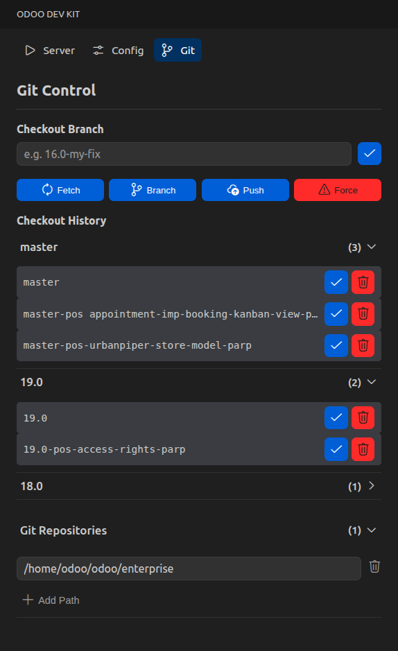

# Odoo Dev Kit

VS Code sidebar to configure and run Odoo quickly — with a generated command, server controls, helpful presets, and full **Git branch management** across all your repositories.

## Features

### 🖥️ Server

- Configure Odoo addons, CLI options, and environment paths.
- Generate a ready-to-run Odoo command.
- Run / stop the server from the sidebar.
- Drop the current database and re-run the server in one click.
- Auto-detect a default database name from the first addon branch (optional).

### ⚙️ Config

- Add multiple addon paths with individual enable/disable toggles.
- Set Python venv and `odoo-bin` paths.
- Toggle CLI flags (dev mode, log level, workers, etc.) per group.

### 🌿 Git Control

Manage Git branches across **all your Odoo repositories at once** — framework, enterprise, and custom addons — from a single panel.

#### Checkout Branch
- Enter a branch name (e.g. `16.0-my-feature`) and click **✓**.
- For each configured repository the extension will:
  - Run `git fetch --all` to refresh all remotes.
  - Scan **every remote** (not just `origin` — supports `odoo`, `odoo-dev`, `ent`, `ent-dev`, etc.) to find if the branch exists.
  - If found on any remote → checkout that branch.
  - If not found → extract the base version (`16.0`, `17.0`, `saas-16.3`, `master`) from the branch name and checkout the version branch instead.
- All repositories are checked out **in parallel**.
- The branch input is cleared only **after** all checkouts complete successfully.

#### Checkout History
- Every successful checkout is saved locally, grouped by version in an accordion (e.g. `16.0 (3)`).
- Hover over any history entry to **re-checkout** ✓ or **remove** 🗑 it from the list.

#### Action Buttons (one-line row)
| Button | Action |
|--------|--------|
| **Fetch** | `git fetch --all` on every repo |
| **Branch** | Create the branch name typed in the input across all repos |
| **Push** | Push the current branch to its tracking remote |
| **Force** | Force-push the current branch (`-f`) |

> **Multi-remote support**: the extension automatically detects the tracking remote for each repository (`git rev-parse @{u}`) and falls back to the first available remote if no upstream is set.

#### Git Repositories Configuration
- Collapsed accordion at the bottom of the panel.
- Add / remove absolute paths for each Git repository you want to manage.
- If no paths are configured, the extension falls back to the `odooBinPath` directory and addon paths from the Config page.

#### Loading Indicator
- A thin animated progress bar appears at the top of the panel while any Git operation is running.
- All action buttons are disabled during an operation to prevent double-triggers.

---

### Screenshots
| Config | Server | Git Control |
| --- | --- | --- |
|  |  |  |

## Requirements

- Python venv for your Odoo instance (optional but recommended).
- Odoo source directory and addons paths.
- PostgreSQL tools if you use the Drop DB action.
- Git available in PATH.

## Server Actions

- **Run server**: runs Odoo and includes `-u` only (update mode).
- **Drop DB and run**: drops the current database and runs Odoo with `-i` only (init mode).

## Library Usage

- **OWL**: used to build the sidebar UI.

## License

MIT
